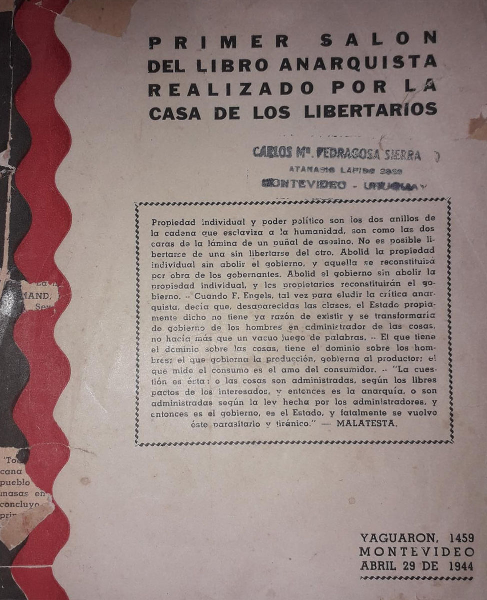

+++
title="La primera feria del libro anarquista de Montevideo y del mundo."
date=2022-03-01

[taxonomies]
tags = ["Feria", "Histórico"]
+++

<!-- more -->

Las Ferias del Libro Anarquistas se han popularizado a lo largo y ancho del planeta en los últimos años. Las mismas son una muestra de la constante y prolifera actividad cultural e ideológica del movimiento, expresada tanto en la continua edición de materiales (libros, revistas, etc) como su difusión y discusión en las charlas, exposiciones y controversias que en las mismas se realizan.

En Montevideo se han realizado 8 ferias del libro anarquista, las cinco primeras transcurrieron entre los años 2012 y 2016 en el local del Centro Social Autónomo La Solidaria desalojado en 2017. Las siguientes se realizaron en el Centro Social Cordón Norte los años siguientes, contando con una importante afluencia de publico de diversas regiones del continente y el mundo.
Si bien se considera el comienzo de estas instancias la realizada en Londres en 1983, encontramos en Montevideo un origen anterior cuando el 29 de abril de 1944 se inauguró el “Primer Salón del libro anarquista”, que si bien varía en el titulo del evento el formato es exactamente igual.
La actividad consistía en la exposición de casi mil libros anarquistas de diversos autores y temáticas [(Ver acá)](http://ateneuenciclopedicpopular.org/wp-content/uploads/2021/01/primer-salon-del-libro-anarquista-abril-1944.pdf) y la realización de instancias de discusión sobre “los problemas fundamentales de nuestras ideas a través de disertadores con tribuna libre” todos los sábados del mes de mayo y junio a las 22.30 hs en el local de “La Casa de los Libertarios” ubicado en Yaguarón y Mercedes.

La Casa de los Libertarios se había fundado en octubre de 1943 y se proponía en su declaración de principios: “Sostener el principio de libertad como elemento esencial para el desarrollo integral del hombre y para una más armoniosa relación social; por ende considera el sistema de gobierno del hombre por el hombre, igual que la actividad política tendiente al mismo, como propósitos negadores de ese principio. (…) Desarrollar y practicar la acción directa como táctica de lucha para poder construir los valores humanos imprescindibles para una sociedad sin opresores ni oprimidos; sin explotados ni explotadores.”

Como se ve la práctica regenerativa y de acción directa anarquista ha sido una constante en nuestra región, la cual impulsó las primeras asociaciones obreras, asociaciones cooperativas y las primeras luchas revolucionarias contra el Estado y su consolidación capitalista, y son los mismos principios y pautas de acción que orientan hoy las diversas luchas autónomas que priorizan la autoorganización social y la acción directa despreciando los callejones sin salida de la institucionalidad democrática que tan solo pretende dar pequeñas concesiones para asegurar que los problemas estructurales no cambien.
Hoy, al igual que lxs compañerxs de La Casa de Lxs Libertarixs apostamos a “desarrollar y practicar la acción directa como táctica de lucha para poder construir los valores humanos imprescindibles para una sociedad sin opresores ni oprimidos; sin explotados ni explotadores.”

De los compañeros de: [Periódico Anarquía](http://periodicoanarquia.wordpress.com/?fbclid=IwAR1gKDHQNfN00fVfXOdXmwm7knK2NCXk787WiKbuJ1X2G2fwjpfhQR_HF20)